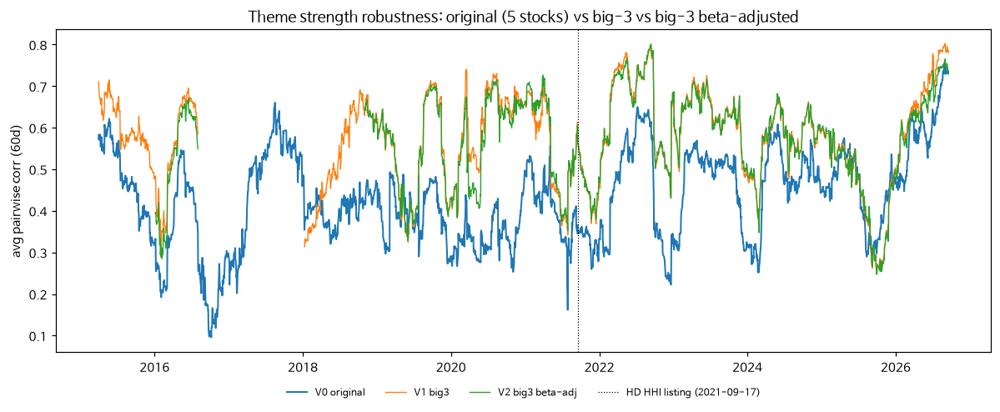
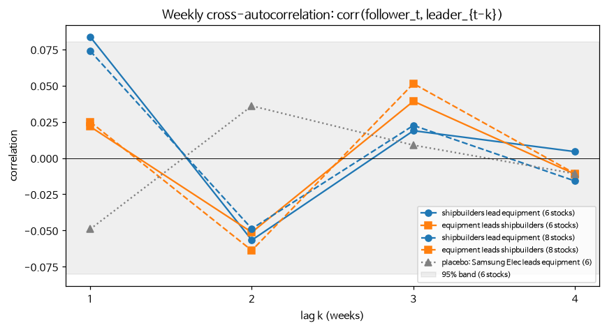
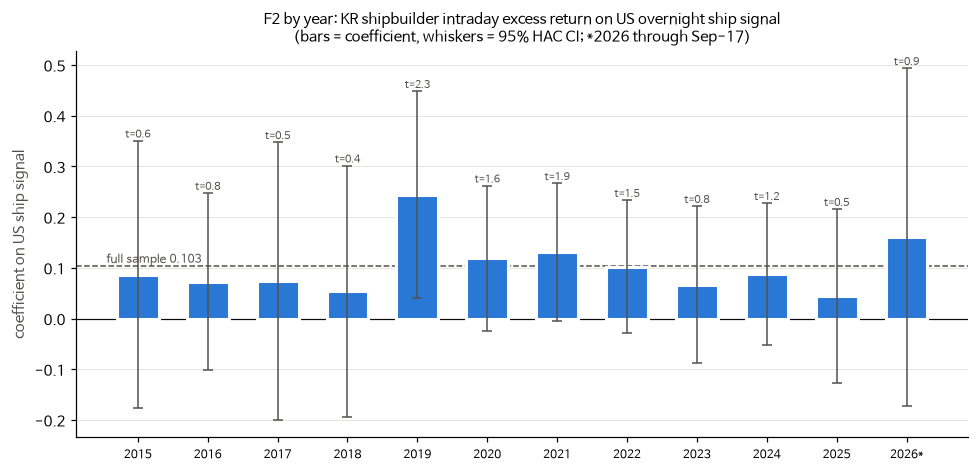
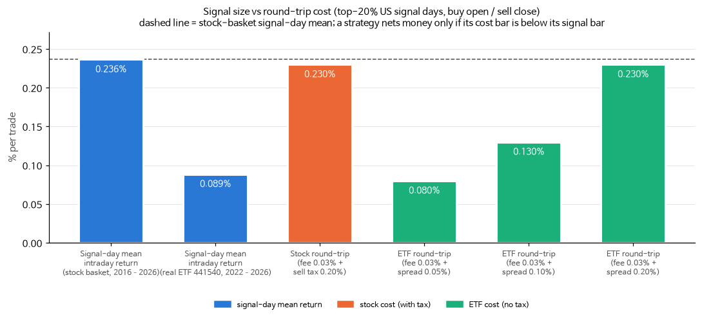

# 한국 조선주 퀀트 케이스스터디

한국 조선 섹터(HD한국조선해양·HD현대중공업·삼성중공업·한화오션 등)를 대상으로 한 가설 검증 모음입니다. 대상은 섹터 동조화, 공시 이벤트, 페어트레이딩, 선후행, 크로스에셋 신호입니다.

**한 줄 결론**: 조선주는 강하게 같이 움직이고, 미국 밤사이 신호도 다음 날 장중 수익으로 전달됩니다. 하지만 비용을 빼면 돈이 되는 전략은 찾지 못했습니다.

- 데이터 기간: 2015-01-02 ~ 2026-09-17
- 모든 파라미터는 결과를 보기 전에 정했고, 결과를 본 뒤 바꾸지 않았습니다. 사후 분석은 문서에 "사후" 또는 "참고"로 표시했습니다.
- 가설마다 다중검정 보정 기준(Bonferroni)을 함께 보고합니다.

## 결과 요약

| 파트 | 질문 | 판정 | 요약 문서 |
|---|---|---|---|
| A | 테마 강도(쌍별 상관)가 높으면 이후 섹터 수익이 반전되는가 | 지지 안 됨 | [outputs/results_summary.md](outputs/results_summary.md) |
| A 강건성 | 대형 3사 고정·베타 조정으로 바꾸면 결론이 바뀌는가 | 반전·레짐 결론은 그대로 | [results/robust_A/robustA_summary.md](results/robust_A/robustA_summary.md) |
| B | 수주 공시 이벤트 반응 | 공시일 반응은 작지만 양(+)이고, 사전 누출은 없음 | [outputs/results_summary.md](outputs/results_summary.md) |
| C | 롱온리 섹터 타이밍(테마 과열 회피) | 단순 보유보다 CAGR·Sharpe가 낮음 | [outputs/results_summary.md](outputs/results_summary.md) |
| D | 공적분 페어트레이딩 | 비용 후 성과가 미미하고, 선택 편향이 있음 | [results/PartDE_summary.md](results/PartDE_summary.md) |
| E | 지주사 vs 자회사 상대가격 평균회귀 | 지지 안 됨 | [results/PartDE_summary.md](results/PartDE_summary.md) |
| F | 미국 조선·LNG·해운 신호 → 다음 날 한국 조선 장중 수익 | **통계적으로 지지됨(t = 3.68)**, 비용 후 수익은 없음 | [results_cross/FGH_summary.md](results_cross/FGH_summary.md) |
| G | 지정학 충격 이벤트 | 체계적 반응 없음(11개 중 1건) | [results_cross/FGH_summary.md](results_cross/FGH_summary.md) |
| H | 해운 → 조선 선후행 | 다중검정 보정 시 지지 안 됨(명목 5%에서는 1주 선행, 경계선) | [results_cross/FGH_summary.md](results_cross/FGH_summary.md) |
| I | 대형 조선사 → 기자재 선행 (Hou 2007) | 지지 안 됨 | [results/leadlag_pairs/FINAL_summary.md](results/leadlag_pairs/FINAL_summary.md) |
| J | 거리 기반 페어 (GGR 2006, 룩어헤드 없음) | 손실 — Part D의 수익은 선택 편향으로 설명될 수 있음 | [results/leadlag_pairs/FINAL_summary.md](results/leadlag_pairs/FINAL_summary.md) |
| F 확장 | 시가 품질, F2 안정성, 거래세 없는 ETF 우회, 동조화 연결 | F2는 안정적이지만, ETF로도 비용 후 유의한 수익 없음 | [results/F_ext/F_ext_summary.md](results/F_ext/F_ext_summary.md) |

### 핵심 그림

| | |
|---|---|
| 조선 동조화(60일 평균 쌍별 상관) — [fig_A1_robust.png](results/robust_A/fig_A1_robust.png) | 조선 ↔ 기자재 시차 상관 — [fig_I1_ccf.png](results/leadlag_pairs/fig_I1_ccf.png) |
|  |  |
| 미국 신호의 연도별 계수 — [fig_F_yearly.png](results/F_ext/fig_F_yearly.png) | 신호 크기 vs 왕복 비용 — [fig_cost_barrier.png](results/F_ext/fig_cost_barrier.png) |
|  |  |

## 폴더 구성

```
├── shipbuilding_quant_case.ipynb      # Part A~C
├── shipbuilding_quant_case_1.ipynb    # Part D·E + Part A 강건성 셀
├── shipbuilding_crossasset.ipynb      # Part F·G·H
├── shipbuilding_leadlag_pairs.ipynb   # Step 0(기자재 유니버스) · Part I · Part J
├── shipbuilding_F_extension.ipynb     # Part F 확장 (Step 0~4)
├── fig_A1_theme.png                   # 최초 실행 때 만든 그림 (최신본은 outputs/)
├── outputs/          # Part A~C 결과, 요약, 실행본 노트북
├── results/          # Part D·E 결과
│   ├── robust_A/     # Part A 강건성
│   ├── leadlag_pairs/# Part I·J (+ Step 0 유니버스 결정 기록)
│   └── F_ext/        # Part F 확장
└── results_cross/    # Part F·G·H
```

각 결과 폴더에는 요약(`*.md`), 표(`*.csv`), 그림(`*.png`)이 있습니다. 일부 폴더에는 실행본 노트북(`*_executed.ipynb`)도 들어 있습니다.

## 재현 방법

```bash
conda create -n ship python=3.11
conda activate ship
pip install -r requirements.txt
python -m ipykernel install --user --name ship
```

- **DART API 키**는 환경변수 `DART_API_KEY`로만 읽습니다. 키가 비어 있으면 노트북이 멈춥니다. 키를 코드나 파일에 적지 마세요.
  - Windows (PowerShell): `$env:DART_API_KEY = "<발급받은 키>"`
  - macOS/Linux: `export DART_API_KEY=<발급받은 키>`
- 주가는 pykrx의 네이버 수정주가 경로로 받습니다. pykrx의 KRX 경로는 현재 로그인이 필요해 쓰지 않습니다.
  - 지수는 FinanceDataReader, 미국 데이터는 yfinance를 씁니다.
  - 수정 전 시세·거래대금·ETF 정보는 네이버 모바일 시세 API를 씁니다.
- 노트북 실행 순서: `shipbuilding_quant_case` → `_1` → `crossasset` → `leadlag_pairs` → `F_extension`
  - 뒤의 노트북 일부는 앞 결과 파일을 읽습니다(예: Part F 확장은 `results/robust_A/RA1_theme_series.csv`).
- 외부 데이터 소스가 수정되거나 소급 조정되면 숫자가 조금 달라질 수 있습니다. 예: yfinance 배당 조정, FDR 지수 지연.

## 주의

- 기자재 종목 목록은 현재 상장 종목 기준이라 **생존 편향**이 있습니다.
- 백테스트의 시가 체결은 동시호가 가격이라, 실제 대량 주문은 더 불리할 수 있습니다.
- 공매도 가능 여부, 대차 수수료(연 3% 가정), 일부 KOSPI200 구성 여부는 추정값입니다. 근거는 각 요약 문서에 있습니다.
- 이 저장소는 연구·학습용 분석이며 투자 권유가 아닙니다.
